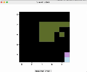
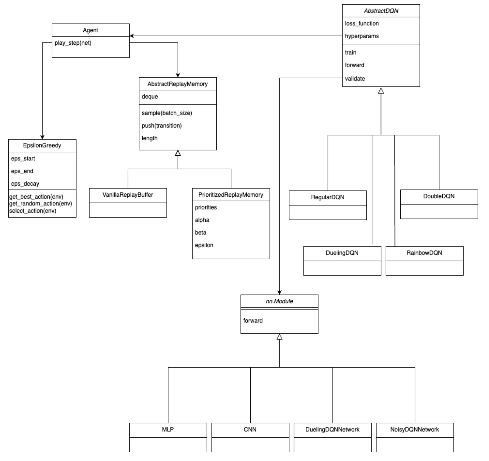
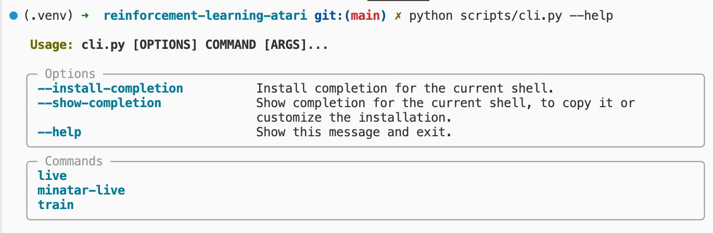
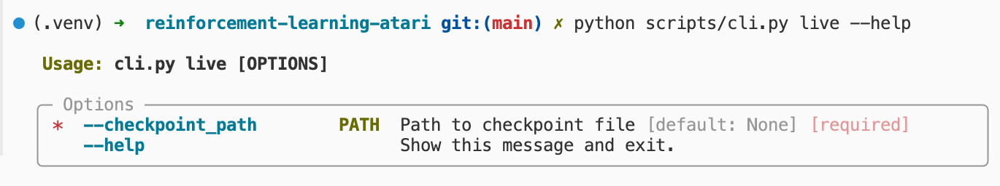
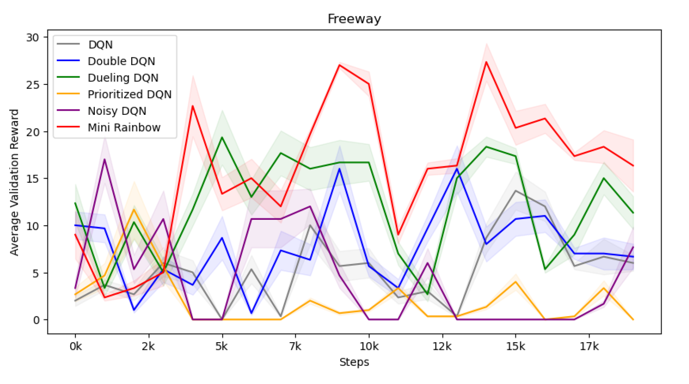
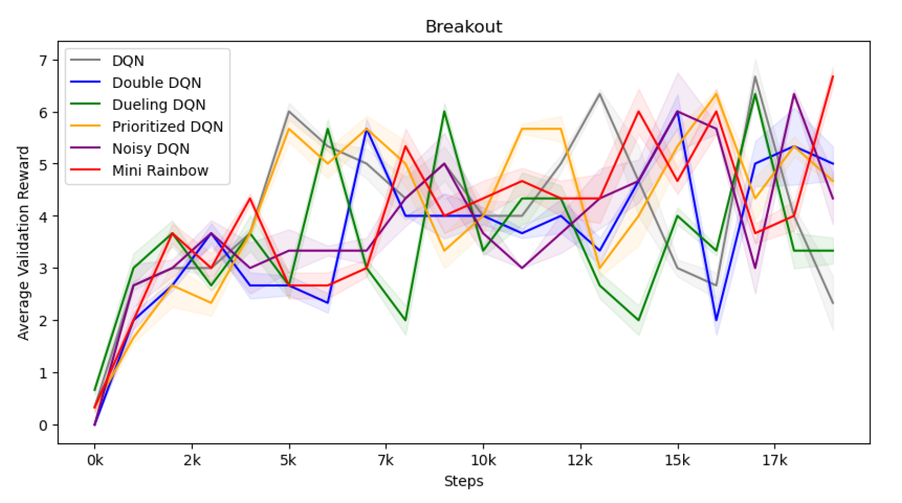

# Reinforcement-Learning-Atari-Framework

> Collection of DQN Implementations for Atari games from the [MinAtar](https://github.com/kenjyoung/MinAtar) library.

> Framework for training and testing DQN agents on Atari games (also compatible with every other OpenAI Gym environment).

## Teaser Video



## Table of Contents

- [Reinforcement-Learning-Atari-Framework](#reinforcement-learning-atari-framework)
  - [Teaser Video](#teaser-video)
  - [Table of Contents](#table-of-contents)
  - [Introduction](#introduction)
  - [Class Diagram](#class-diagram)
  - [Tutorial](#tutorial)
    - [Installation](#installation)
    - [Training](#training)
      - [Training from config file](#training-from-config-file)
    - [Live Mode](#live-mode)
    - [Live Demonstration](#live-demonstration)
      - [Command](#command)
      - [Live Demo Examples](#live-demo-examples)
    - [Results](#results)

## Introduction

This repository contains a framework for the Deep Learning DQN algorithm with the following extensions:

- [x] Double DQN
- [x] Prioritized Experience Replay
- [x] Dueling DQN
- [x] Noisy DQN
- [x] Rainbow DQN

It is also possible to train the agent on any OpenAI Gym environment.

## Class Diagram



## Tutorial

### Installation

To install the required packages, run the following command:

```bash
pip install -r requirements.txt
```

### CLI Script

To make the usage more convenient, a CLI script is provided. Documentation is available by adding the `--help` flag to the command, e.g.:



Helper menu is also available for all subcommands, e.g.:



### Training

Training parameters are fully documented in the CLI client. Run the following command to see all the available options:

```bash
python scripts/cli.py train --help
```

to revise all possible parameters. These are passed as command line arguments.

#### Training from config file

It is possible to pass all the training parameters from a config file instead of the command line. Exemplary config files are provided in the `configs` directory. They are written in YAML format, e.g.:

```yaml
max_epochs: 10000
env: MinAtar/Freeway
device: cuda
rollouts_per_validation: 3
validate_every_n_epochs: 1000
``````

To train an agent from a config file, run the following command:

```bash
python scripts/cli.py train -f <path-to-config-file>
```

### Live Mode

To run the agent in live mode, run the following command:

```bash
python scripts/cli.py live --help
```

or for MinAtar environments:

```bash
python scripts/cli.py minatar-live --help
```

for MinAtar environments.

### Live Demonstration

#### Command

```bash
python scripts/cli.py minatar-live --checkpoint_path <path-to-checkpoint>
```

#### Live Demo Examples

```bash
python scripts/cli.py minatar-live --checkpoint_path data/Breakout/mini_rainbow/03/checkpoints/epoch=9999-step=20000.ckpt
```

```bash
python scripts/cli.py minatar-live --checkpoint_path data/Freeway/mini_rainbow/03/checkpoints/epoch=9999-step=20000.ckpt
```

```bash
python scripts/cli.py minatar-live --checkpoint_path logs/MinAtar_SpaceInvaders/version_0/checkpoints/epoch=49999-step=100000.ckpt
```

## Results

### MinAtar/FreeWay



### MinAtar/Breakout


